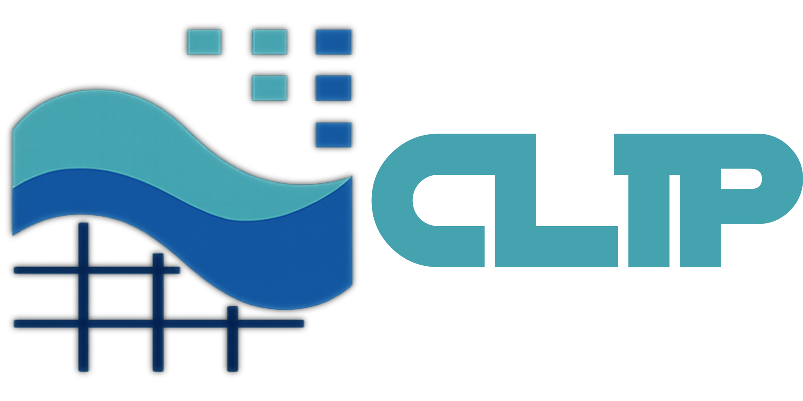

[](https://opensource.org/licenses/Apache-2.0)

<p align="center">
  
</p>

<h1 align="center"><strong> CLIP: A CUDA-Accelerated Lattice Boltzmann Framework for Interfacial Phenomena</strong></h1>

**CLIP** is a high-performance, extensible Lattice Boltzmann Method (LBM) library developed in C++/CUDA, designed to simulate interfacial phenomena such as bubbles, drops, and jets in both 2D and 3D domains. It features a modular, GPU-accelerated architecture that enables easy integration of additional physical models and equations. With its fully configurable input system, CLIP allows users to explore diverse simulation scenarios without modifying code, making it an ideal tool for rapid prototyping and research.


## 📚 Table of Contents

- [Features](#-key-features)
- [Examples](#-examples)
- [Installation](#installation)
- [Usage](#usage)
- [Examples](#examples)
- [Documentation](#documentation)
- [License](#license)


---

## 🚀 Key Features


- ⚡ **CUDA-Accelerated**: Optimized LBM kernels for high-performance GPU simulations.  
- 🌊 **Interfacial Flows**: Supports bubbles, drops, jets, and two-phase instabilities.  
- 🧱 **Rich Boundary Conditions**: Includes velocity, periodic, Neumann, wall, slip-wall, free-convective, and do-nothing types.  
- 🔁 **Checkpointing**: Save/resume simulations for long or staged runs.  
- 🧪 **Config-Driven Setup**: Flexible `config.txt` for physics, geometry, and runtime control.  
- ⚖️ **Stable with WMRT**: Weighted multiple relaxation time ensures robust, accurate results.  
- 🌗 **Allen–Cahn Interface Tracking**: Conservative phase-field model with mass conservation.  
- 🧩 **2D/3D Support**: D2Q9 and D3Q19 lattices for 2D and 3D flows.  
- 🔧 **Precision Switch**: Easily toggle between single and double precision to support both high-end and resource-constrained systems.


---

## 📊 Examples

- [ ] Rayleigh–Taylor instability with cosine perturbation
- [ ] Droplet oscillation test case
- [ ] 3D bubble rise
- [ ] Jet breakup and pinch-off

---


<h3 align="center"><strong> Rayleigh–Taylor Instability</strong></h3>

<p align="center">
  
  
</p>
<p align="center">
Figure: Visualization of 2D and 3D Rayleigh–Taylor instability simulations performed using CLIP, a GPU-accelerated Lattice Boltzmann Method (LBM) solver.
</p>

<h3 align="center"><strong> Liquid Jet Simulation</strong></h3>


<h3 align="center"><strong> Bubble/Drop Dynamics</strong></h3>


<p align="center">
  
</p>

<p align="center">
  
</p>


## 🧰 Build Instructions

### Prerequisites

- CUDA 11.0+
- CMake ≥ 3.18
- GCC ≥ 9
- NVIDIA GPU (e.g. V100, A100, RTX series)
- Python for post-processing (optional)

### Build

```bash
git clone https://github.com/your-org/culbm.git
cd culbm
mkdir build && cd build
cmake .. -DCMAKE_BUILD_TYPE=Release
make -j
```

---

## 🧪 Running a Case

```bash
./culbm tests/2D/Bubble/config.txt
```

Visit the `tests/` folder for examples including:

- Bubble collapse
- Drop dynamics
- Rayleigh–Taylor instability
- Jet initialization

---

## 🧾 Configuration Format

Example `config.txt`:

```ini
case = bubble
finalStep = 10000
interfaceWidth = 4
gravity = 1e-6
mobility = 0.02
rhoRatio = 1000
muRatio = 50

N = [64, 128, 1]
C = [32.5, 64, 1]
D = 25

geometry = [
  {
    type = "circle"
    center = [32.5, 64, 0]
    radius = 12
    id = 0
  },
  {
    type = "perturbation"
    center = [64, 64, 1]
    amplitude = 0.05
    id = 1
  }
]

boundary = [
  {
    side = "x-"
    type = "periodic"
  },
  {
    side = "x+"
    type = "periodic"
  },
  {
    side = "y-"
    type = "wall"
  },
  {
    side = "y+"
    type = "wall"
  }
]
```

---

## 📦 Capabilities

| Category              | Support                        |
|-----------------------|---------------------------------|
| LBM Models            | BGK (stable), MRT (WIP)         |
| Lattice Structures    | D2Q9, D3Q19                     |
| Geometry via SDF      | Circle, Sphere, Square, Cube, Perturbation |
| Initial Conditions    | Bubble, Drop, Jet, RTI          |
| Boundary Conditions   | Periodic, Wall, SlipWall, Neumann, FreeConvect |
| Restart / Checkpoint  | ✅ Yes                           |
| Output                | ASCII VTK, Binary Checkpoints   |

---


## 📚 Citation

If you use cuLBM in your work, please cite:

```bibtex
@software{culbm2024,
  author  = {Your Name},
  title   = {cuLBM: A CUDA-based Lattice Boltzmann Framework for Interfacial Flow},
  year    = {2024},
  url     = {https://github.com/your-org/culbm}
}
```

---

## 🛣️ Roadmap

- [ ] Multiphase Shan-Chen or Free-Energy model
- [ ] Adaptive mesh refinement
- [ ] Multi-GPU via NCCL or MPI
- [ ] Thermal and compressible LBM
- [ ] Geometry-based refinement and tagging

---

## 🤝 Contributing

We welcome contributions! Please fork the repo and submit a pull request. If you're unsure where to start, check the [issues](https://github.com/your-org/culbm/issues) page or reach out via email.

---

## 📬 Contact

Created and maintained by **Your Name**  
📧 email@example.com  
🌐 [your-website.com](https://your-website.com)

---
